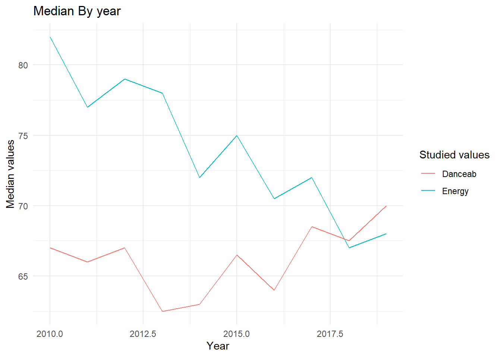

::: {.cell}

:::


<center>

# Dplyr-Lab (Friday-Group)

</center>

<center>

GitHub link : <https://github.com/CBZ1310/Dplyr-Lab—Friday-Group>

GitHub code : <https://github.com/CBZ1310/Dplyr-Lab—Friday-Group.git>

</center>

## Exercise 1

### Question 1 : A global perspective on the music scene during the last decade


::: {.cell}

:::

::: {.cell}

:::

::: {.cell}

:::


During the decade, 584 songs has been produced by 184 artists. 50 different musical genres inhabited the nightclubs, house and playlists.

### Question 2 : Number of songs per year


::: {.cell}
::: {.cell-output-display}
Table: Volume of production

| Release year| Number of songs|
|------------:|---------------:|
|         2010|              51|
|         2011|              49|
|         2012|              35|
|         2013|              70|
|         2014|              57|
|         2015|              94|
|         2016|              74|
|         2017|              64|
|         2018|              62|
|         2019|              31|
:::
:::


### Question 3 : Most prolific artist


::: {.cell}
::: {.cell-output .cell-output-stdout}
```
The  artist producing more songs was Katy Perry with  17 songs
```
:::
:::


### Question 4 : BPM


::: {.cell}
::: {.cell-output-display}
Table: Statistics on the BPM

|top genre                 | Number of songs| Min| Mediane|  Moyenne| Max| Sd in percentage|
|:-------------------------|---------------:|---:|-------:|--------:|---:|----------------:|
|acoustic pop              |               2| 125|   155.0| 155.0000| 185|        0.2737188|
|alaska indie              |               1| 132|   132.0| 132.0000| 132|               NA|
|alternative r&b           |               1| 136|   136.0| 136.0000| 136|               NA|
|art pop                   |               8|  94|   108.5| 115.1250| 150|        0.1767039|
|atl hip hop               |               4|  80|   112.0| 108.5000| 130|        0.2010118|
|australian dance          |               6|  87|   115.0| 128.8333| 192|        0.3492166|
|australian hip hop        |               1|  95|    95.0|  95.0000|  95|               NA|
|australian pop            |               5| 127|   150.0| 153.8000| 186|        0.1701351|
|barbadian pop             |              15|  78|   127.0| 125.3333| 206|        0.2962992|
|baroque pop               |               2| 108|   146.0| 146.0000| 184|        0.3680830|
|belgian edm               |               2| 122|   122.0| 122.0000| 122|        0.0000000|
|big room                  |              10| 106|   125.0| 122.3000| 134|        0.0722191|
|boy band                  |              15|  77|   120.0| 116.1333| 160|        0.1973750|
|british soul              |               9|   0|   108.0| 109.3333| 164|        0.4390244|
|brostep                   |               2| 100|   121.0| 121.0000| 142|        0.2454420|
|canadian contemporary r&b |               7|  93|   120.0| 130.0000| 186|        0.2926449|
|canadian hip hop          |               2| 100|   109.0| 109.0000| 118|        0.1167699|
|canadian latin            |               1|  98|    98.0|  98.0000|  98|               NA|
|canadian pop              |              31|  65|   119.0| 122.1290| 192|        0.2253006|
|candy pop                 |               2|  92|   109.0| 109.0000| 126|        0.2205654|
|celtic rock               |               1|  85|    85.0|  85.0000|  85|               NA|
|chicago rap               |               1| 125|   125.0| 125.0000| 125|               NA|
|colombian pop             |               3| 112|   128.0| 126.0000| 138|        0.1040863|
|complextro                |               6| 102|   127.0| 120.3333| 130|        0.1005048|
|contemporary country      |               1|  86|    86.0|  86.0000|  86|               NA|
|dance pop                 |             323|  43|   120.0| 118.5975| 202|        0.1893907|
|danish pop                |               1| 120|   120.0| 120.0000| 120|               NA|
|detroit hip hop           |               2|  82|    84.5|  84.5000|  87|        0.0418406|
|downtempo                 |               2| 100|   133.5| 133.5000| 167|        0.3548776|
|edm                       |               4|  90|   102.0| 103.0000| 118|        0.1126660|
|electro                   |               2| 100|   108.0| 108.0000| 116|        0.1047566|
|electro house             |               1| 124|   124.0| 124.0000| 124|               NA|
|electronic trap           |               2|  96|    98.0|  98.0000| 100|        0.0288615|
|electropop                |              13|  90|   103.0| 112.8462| 160|        0.2000859|
|escape room               |               2|  96|   127.0| 127.0000| 158|        0.3452017|
|folk-pop                  |               2|  75|    80.5|  80.5000|  86|        0.0966233|
|french indie pop          |               1| 123|   123.0| 123.0000| 123|               NA|
|hip hop                   |               4|  80|    91.5|  93.7500| 112|        0.1453109|
|hip pop                   |               6|  93|    98.5| 100.6667| 111|        0.0867524|
|hollywood                 |               1|  92|    92.0|  92.0000|  92|               NA|
|house                     |               1| 122|   122.0| 122.0000| 122|               NA|
|indie pop                 |               2| 148|   151.5| 151.5000| 155|        0.0326716|
|irish singer-songwriter   |               1| 129|   129.0| 129.0000| 129|               NA|
|latin                     |               4|  94|   141.5| 140.7500| 186|        0.3407032|
|metropopolis              |               1| 127|   127.0| 127.0000| 127|               NA|
|moroccan pop              |               1| 110|   110.0| 110.0000| 110|               NA|
|neo mellow                |               9|  76|   116.0| 109.1111| 138|        0.1836110|
|permanent wave            |               4| 125|   138.0| 137.2500| 148|        0.0697262|
|pop                       |              55|  77|   116.0| 116.8727| 190|        0.2148000|
|tropical house            |               2| 120|   129.5| 129.5000| 139|        0.1037454|
:::
:::


### Question 5 : Energy and Dance ability


::: {.cell}
::: {.cell-output-display}
Table: Key Medians

| year| Energy| Danceab|
|----:|------:|-------:|
| 2010|   82.0|    67.0|
| 2011|   77.0|    66.0|
| 2012|   79.0|    67.0|
| 2013|   78.0|    62.5|
| 2014|   72.0|    63.0|
| 2015|   75.0|    66.5|
| 2016|   70.5|    64.0|
| 2017|   72.0|    68.5|
| 2018|   67.0|    67.5|
| 2019|   68.0|    70.0|
:::
:::


### Question 6 :


::: {.cell}
::: {.cell-output-display}
{width=672}
:::
:::


## Exercise 2


::: {.cell}

:::


### Question 1 : Age of enrollement


::: {.cell}
::: {.cell-output-display}
Table: Median Age of Enrollment

|Gender |Marital status    | Median value|
|:------|:-----------------|------------:|
|Male   |single            |         20.0|
|Male   |married           |         37.0|
|Male   |divorced          |         40.5|
|Male   |widower           |         43.0|
|Male   |facto union       |         34.0|
|Male   |legally separated |         55.0|
|Female |single            |         19.0|
|Female |married           |         34.0|
|Female |divorced          |         38.0|
|Female |widower           |         21.0|
|Female |facto union       |         27.0|
|Female |legally separated |         41.0|
:::
:::


### Question 2 : New tables


::: {.cell}
::: {.cell-output-display}
Table: Median Age of Enrollment (v2)

|Marital status    | Male| Female|
|:-----------------|----:|------:|
|single            | 20.0|     19|
|married           | 37.0|     34|
|divorced          | 40.5|     38|
|widower           | 43.0|     21|
|facto union       | 34.0|     27|
|legally separated | 55.0|     41|
:::
:::


### Question 3 : Conditional means


::: {.cell}
::: {.cell-output-display}
Table: Conditional Mean by Curricular Units

|Target   | Curricular units 1st sem (credited)| Curricular units 1st sem (enrolled)| Curricular units 1st sem (evaluations)| Curricular units 1st sem (approved)| Curricular units 1st sem (grade)| Curricular units 1st sem (without evaluations)| Curricular units 2nd sem (credited)| Curricular units 2nd sem (enrolled)| Curricular units 2nd sem (evaluations)| Curricular units 2nd sem (approved)| Curricular units 2nd sem (grade)| Curricular units 2nd sem (without evaluations)|
|:--------|-----------------------------------:|-----------------------------------:|--------------------------------------:|-----------------------------------:|--------------------------------:|----------------------------------------------:|-----------------------------------:|-----------------------------------:|--------------------------------------:|-----------------------------------:|--------------------------------:|----------------------------------------------:|
|Dropout  |                           0.6094300|                            5.821253|                               7.751583|                            2.551724|                         7.256655|                                      0.1921182|                           0.4496833|                            5.780436|                               7.173821|                            1.940183|                         5.899339|                                      0.2378607|
|Graduate |                           0.8474423|                            6.669534|                               8.276596|                            6.232232|                        12.643655|                                      0.0882752|                           0.6668176|                            6.628339|                               8.142146|                            6.177003|                        12.697276|                                      0.0805794|
|Enrolled |                           0.5075567|                            5.964735|                               9.341310|                            4.318640|                        11.125257|                                      0.1775819|                           0.3589421|                            5.938287|                               9.435768|                            4.057934|                        11.117364|                                      0.1876574|
:::
:::


### Question 4 : Pivot
